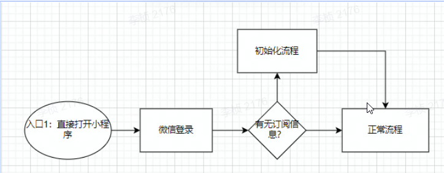
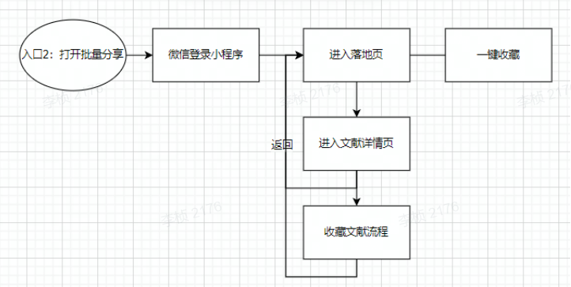
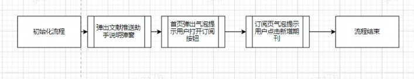

# Paper-Assistant

# PRD文档

[‌‍⁣‌⁢⁢⁣‍‬⁤⁤‌‬⁢⁡⁣⁣⁤‌‍‍⁡‍‍‍‍⁡‬⁤⁣‍⁣‍⁣‬⁣‬⁣⁣‬文献推送助手 PRD - 飞书云文档 (feishu.cn)](https://bingyan.feishu.cn/docs/doccnpuWjY5H5bdBQRiZvUiE2Re#JORyhf)

# 组内分工

- 产经：李桢
- UI：朱明泽
- 前端：李桢 张伟泽
- 后端：马南海 邱启航

# 原型图（墨刀）

[文献推送助手 (modao.cc)](https://modao.cc/app/ff7e83938e6055efc3a0908976ef1fd6f441cf86#screen=skvi1oifbrz6icm)

# UI设计（Figma）

[文件助手 – Figma](https://www.figma.com/file/er5OndO1KmJNDvxziWI2RV/文件助手?node-id=0%3A1)

# 第一次组会 2022/9/20

## 会议目标

- 确保每一位同学都能理解产品逻辑（多问）
- 确保每一位同学都有明确的任务分工（精确可量化）

## 讨论原型和功能逻辑

**原型的变动以及原因：**

1.发现页优先级降低，原有底部导航入口改为收藏

2.去除首页的分享功能，改为更多

3.将订阅入口从我的页面调整到首页侧边栏

4.期刊新增影响因子和期刊号、头像等信息要素

5.新增订阅侧边栏页面

6.新增我的收藏页面

7.新增历史分享页面

**需要讨论的问题：**

1.收藏的UI设计比较（原型内任何UI设计都可讨论）

2.两个版本收藏页面的逻辑比较和选择

3.如何使用户能够尽可能低成本的下载文献（现有方案：复制DOI and 发送下载链接到邮件 and 提供全文链接）

4.订阅侧边栏的删除方式？研究专题的实现可能性？

5.绑定邮箱的技术实现可能性？

6.收藏页面如何新增文件夹？

7.首页的更多功能需要加什么？

8.要不要显示影响因子？期刊位置放哪里？经济前%？

影响因子放在文献页

9.关键词匹配的逻辑关系？

10.推荐系统的逻辑

推荐些别的期刊？

看过了的文献要不要再推？

11.订阅界面入口改回我的页面

12.取消批量下载，下载入口改为复制链接形式，只存在于文献详情页中，并且通过电脑小程序同步打开方式，复制链接或DOI

**首页需要改动的点**

去掉影响因子

左上角去掉订阅入口

更多里面只保留不喜欢这篇文献

**订阅页需要改动的点**

去掉显式icon，改为长按编辑订阅刊物

去掉“我的研究专题”订阅块

MVP只做期刊

**文献详情页需要改动的点**

期刊要显示关注按钮，类似下图知乎用户，显示期刊期号和影响因子

关键词 只显示一行，多的折叠，可以设置展开按钮

新增下载按钮

只给原文链接，不提供下载链接

**收藏页面需要改动的点**

- 长按文献则进行操作，那么显示分享、删除、移动
- 长按文件夹对文件夹进行删除、重命名操作
- 取消批量下载

**我的页进行的改动**

- 删除绑定邮箱

- 订阅入口移到我的页

- 联系我们改为关于我们

# 第二次组会 2022/10/1

## 会议目标

产品原型讨论（初始化机制）

爬虫需求文档演示（web of science sci文献爬取）

设计稿确认

接口文档确认

下一步项目任务排期（前端页面 后端服务器上云）

原型确定和展示

## 产品原型讨论

初始化机制

**总结**

首页初始化

订阅按钮不出现在首页，而是出现一个一次性的按钮跳转到订阅页

需要假数据？

收藏初始化

批量分享落地页，用户完成收藏到文件夹之后，跳转到收藏界面

文献详情页，用户完成收藏后，弹窗提示成功，继续回到文献详情页中（注意逻辑区分）